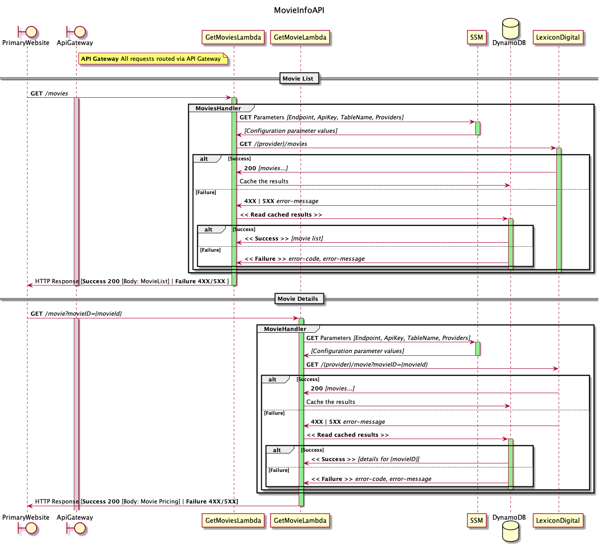
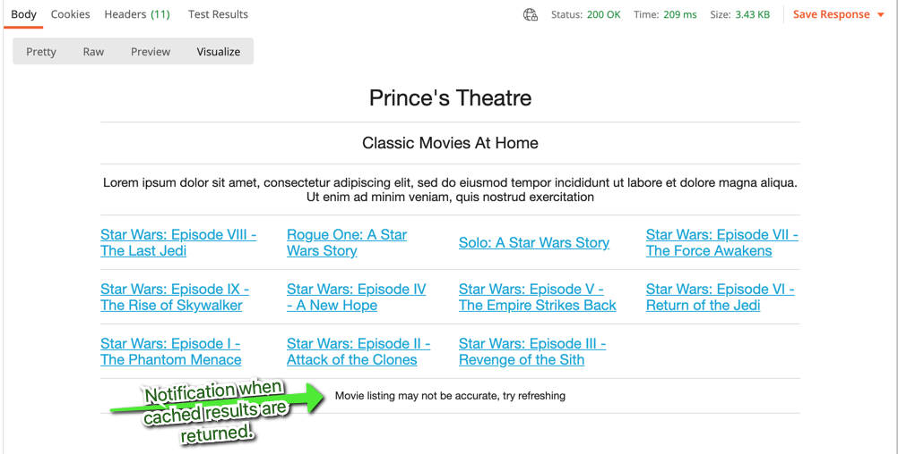
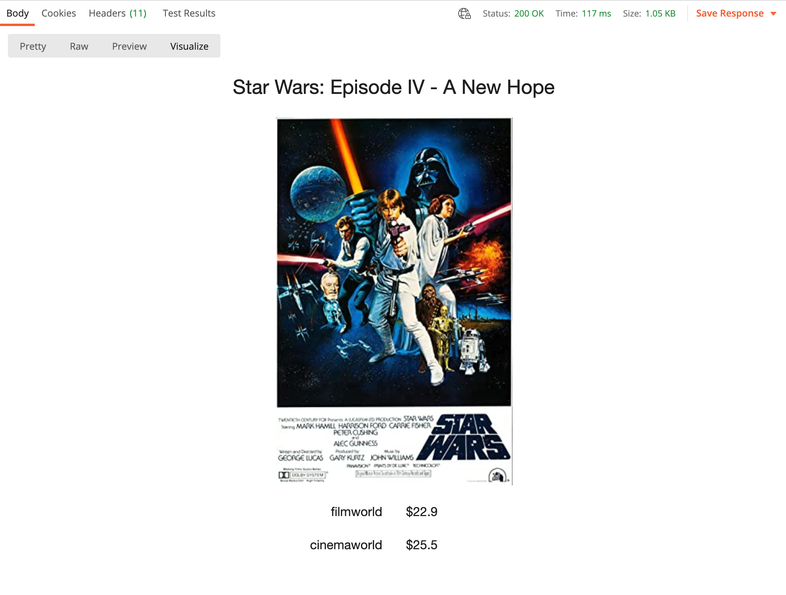
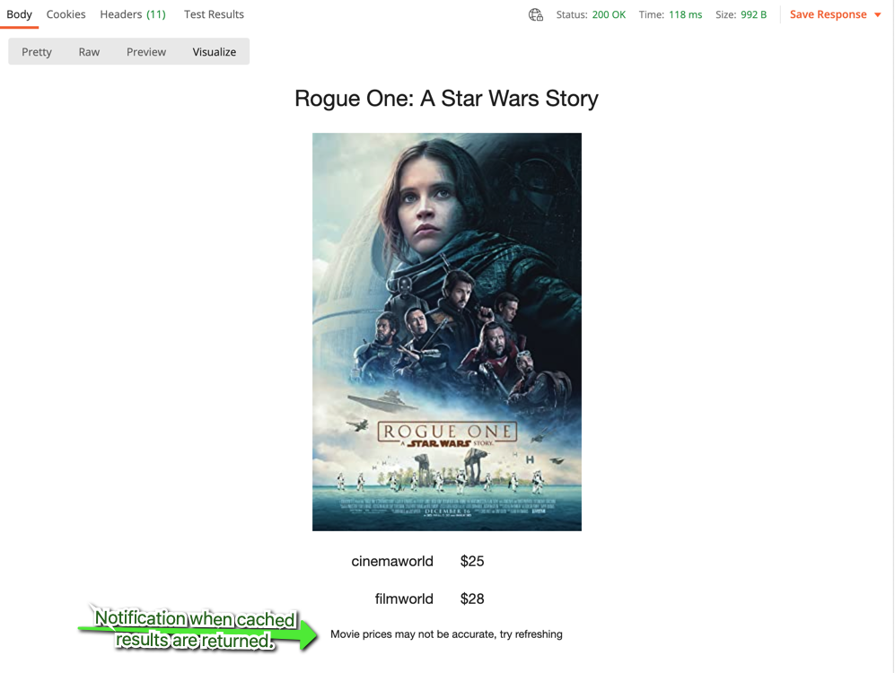

# movie-info

## Description

A solution to be added to a customer’s website that can solve their core problem: allow users to see which of
the two streaming providers are streaming their chosen movie at a lower price.

## Assumptions

* The Movie ID values consistently have the first two characters represent the provider.
* The Movie ID values are the same for each Movie not including the first two characters.
* The Movie titles being offered by each Provider are identical.
* There are only two Providers.
* The Provider labels on the Price screen are populated according to which price is lowest. 
  i.e. Cinemaworld will not always be the first listed. 

## Design

The intention was to create two Lambda HTTP endpoints for the retrieval of the list of available Movies
and the details of a specific Movie. The endpoints are to be accessed by a static webpage hosted in an
appropriately configured S3 bucket.

The dynamic content of the webpages would be retrieved using scripts in the static webpage by running
in the browser, accessing the Lambda endpoints and using a HandlebarsJS template for generation
of the content. _Unfortunately the static webpage has not been completed, but WIP can be view in the
included **Postman** collection._

### Sequence diagram


## Implementation

The basics of this project were generated using AWS SAM CLI.

```bash
.
├── Makefile                    <-- Make to automate build
├── README.md                   <-- This instructions file
├── lambdas
│   ├── getMovies
│   │   ├── main.go             <-- Source code for the getMovies Lambda function
│   │   └── main_test.go        <-- Tests
│   └── getMovies 
│       ├── main.go             <-- Source code for the getMoview Lambda function
│       └── main_test.go        <-- Tests
└── template.yaml
```

## Requirements

* AWS CLI already configured with Administrator permission
* [Docker installed](https://www.docker.com/community-edition)
* [Golang](https://golang.org)
* SAM CLI - [Install the SAM CLI](https://docs.aws.amazon.com/serverless-application-model/latest/developerguide/serverless-sam-cli-install.html)
* AWS_PROFILE environment variable set to the name of an account with Administration privileges

## Setup process

### Installing dependencies & building the target 

Assuming your Golang environment is setup correctly. You will be able to build the project with
 
```shell
make build
```

To deploy the application for the first time, run the following in your shell:

```bash
make deploy
```

The command will package and deploy your application to AWS, with a series of prompts:

* **Stack Name**: The name of the stack to deploy to CloudFormation. This should be unique to your account and region, and a good starting point would be something matching your project name.
* **AWS Region**: The AWS region you want to deploy your app to.
* **Confirm changes before deploy**: If set to yes, any change sets will be shown to you before execution for manual review. If set to no, the AWS SAM CLI will automatically deploy application changes.
* **Allow SAM CLI IAM role creation**: Many AWS SAM templates, including this example, create AWS IAM roles required for the AWS Lambda function(s) included to access AWS services. By default, these are scoped down to minimum required permissions. To deploy an AWS CloudFormation stack which creates or modified IAM roles, the `CAPABILITY_IAM` value for `capabilities` must be provided. If permission isn't provided through this prompt, to deploy this example you must explicitly pass `--capabilities CAPABILITY_IAM` to the `sam deploy` command.
* **Save arguments to samconfig.toml**: If set to yes, your choices will be saved to a configuration file inside the project, so that in the future you can just re-run `sam deploy` without parameters to deploy changes to your application.

You can find your API Gateway Endpoint URL in the output values displayed after deployment.

The API endpoint can also be retrieved using a make task; the output of which contain the 
information in the **MovieInfoAPI** OutputKey.
```shell
make describe-stack
```

Example output.
```shell
{
    "OutputKey": "MovieInfoAPI",
    "OutputValue": "https://ehfia8tqca.execute-api.ap-southeast-2.amazonaws.com/Prod/",
    "Description": "API Gateway endpoint URL for Prod environment"
}
```

### Testing

The `test` task will discover and run all of the tests and perform a lint check on source code the SAM template.

```shell
make test
```

Retrieve a list of available movies
```shell
curl "https://ehfia8tqca.execute-api.ap-southeast-2.amazonaws.com/Prod/movies"
```

Retrieve information a about a specific movie
```shell
curl "https://ehfia8tqca.execute-api.ap-southeast-2.amazonaws.com/Prod/movie?movieId=0076759" 
```

Display the contents of the DyanmoDB table that caches Movie information. 
_You'll first need to find the name of the table with `aws dynamodb list-tables`._
```shell
TABLE_NAME=<table-name> make scan-table
```

## Caveats and needed improvements.

Due to time constraints the following issues have been left outstanding.

* The static website development is not completed. The only rendering of the output is in the Visualisations included in Postman Collection.
* Secrets ( **x-api-key** ) and other configuration data should be stored in AWS Secret Manager and SSM. They are currently hard-coded.
* Test coverage is low and needs to be increased, however TDD techniques we employed during development.
* Lambda 'Handler' code should be refactored to enable fine-grained Unit testing - including the use of mocks for dependencies.
* Code needs refactoring to improve readability and to simplification.
* Possibly consolidate into a single Lambda and use REST API semantics. i.e. `/movies/{movieId}` instead of `/movie?movieId={movieId}`.

## Known issues

* An invocation of the `/movies` endpoint that succeeds in retrieving information from the Lexicon Movie service
  will overwrite pricing information in the MoviesTable. This should be changed so that pricing information is preserved. 
  This issues can cause the next problem.
* It's possible that in rare circumstances one or both prices could show as '$0', however this has not yet been observed.
* Price is displayed with 0 or 1 decimal places. It should always be displayed with 2 decimal places.
* Error scenarios need to be tightened up. A failure to write to DynamoDB will result in an error being returned, 
  despite there being valid information available. This problem has not been observed.
* The Provider labels do not have their first letter capitalised.

## Screenshots





